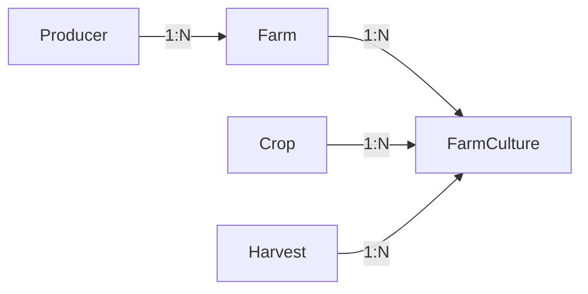

# 🌱 Agri-Manager

Agri-Manager é uma API RESTful desenvolvida para gerenciamento de propriedades rurais, produtores e culturas agrícolas. O sistema permite o controle eficiente de dados agrícolas, incluindo cadastro de produtores, propriedades, safras e culturas, além de fornecer dashboards com análises e métricas importantes do setor agrícola.

## 🚀 Tecnologias Principais

- **Backend**: NestJS (Node.js)
- **Linguagem**: TypeScript
- **Banco de Dados**: PostgreSQL
- **ORM**: Prisma
- **Documentação**: Swagger/OpenAPI
- **Testes**: Vitest
- **Containerização**: Docker

### Arquitetura de aplicação


## ✨ Funcionalidades

- 📝 Cadastro e gerenciamento de produtores rurais
- 🏡 Gestão de propriedades rurais
- 🌾 Controle de culturas e safras
- 📊 Dashboard com métricas e análises
- 🔍 Consultas detalhadas de produtores e propriedades
- 📈 Gráficos de distribuição por estado, cultura e uso do solo

## 🛠️ Pré-requisitos

- Docker e Docker Compose


### 🎲 Rodando o Backend


## Clone o repositório:
```bash
git clone https://github.com/daviaquino87/agri-manager.git
cd agri-manager
```

## Criar o arquivo .env e copiar as variáveis do .env.example
```=shell
cp ./.env.example ./.env
```

### Rodar aplicação e banco de dados
```=shell
docker-compose up -d 
```

### Rodar migrations
```=shell
docker exec -it agri-manager-api npx prisma migrate dev
```

## 📚 Documentação da API

A documentação completa da API está disponível através do Swagger UI quando o servidor estiver rodando:

```
http://localhost:3000/docs
```

## 🧪 Testes

Para executar os testes:

```bash
# Testes unitários
npm run test


## 🏗️ Arquitetura

O projeto segue uma arquitetura em camadas, com os seguintes diretórios principais:

- `src/modules/`: Módulos da aplicação
- `src/common/`: Código compartilhado
- `src/infra/`: Configurações de infraestrutura
- `prisma/`: Configurações e migrações do banco de dados

