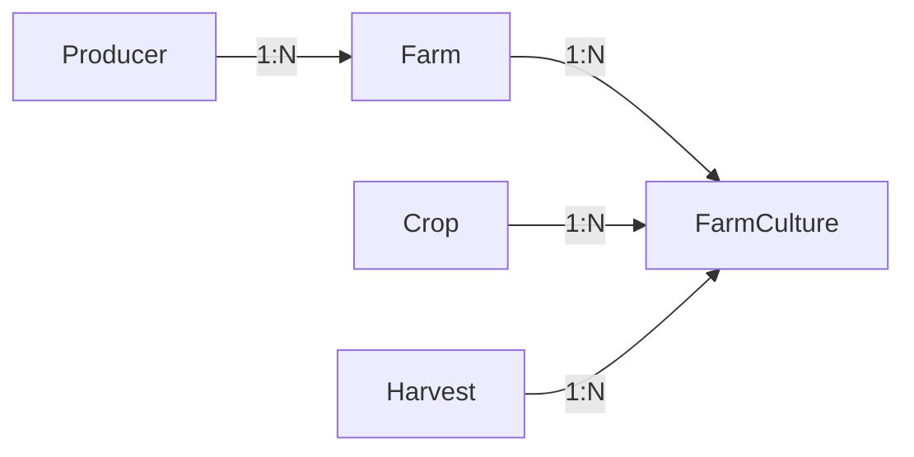

# 🌱 Agri-Manager

Agri-Manager é uma API RESTful desenvolvida para gerenciamento de propriedades rurais, produtores e culturas agrícolas. O sistema permite o controle eficiente de dados agrícolas, incluindo cadastro de produtores, propriedades, safras e culturas, além de fornecer dashboards com análises e métricas importantes do setor agrícola.

## 🚀 Tecnologias Principais

- **Backend**: NestJS (Node.js)
- **Linguagem**: TypeScript
- **Banco de Dados**: PostgreSQL
- **ORM**: Prisma
- **Documentação**: Swagger/OpenAPI
- **Testes**: Vitest
- **Containerização**: Docker

### Arquitetura de aplicação


## ✨ Funcionalidades

- 📝 Cadastro e gerenciamento de produtores rurais
- 🏡 Gestão de propriedades rurais
- 🌾 Controle de culturas e safras
- 📊 Dashboard com métricas e análises
- 🔍 Consultas detalhadas de produtores e propriedades
- 📈 Gráficos de distribuição por estado, cultura e uso do solo

## 🛠️ Pré-requisitos

- Docker e Docker Compose

## Índice
- [Instruções de Setup](#instruções-de-setup)
- [Arquitetura e Decisões Técnicas](#arquitetura-e-decisões-técnicas)
- [Fluxos de Negócio](#fluxos-de-negócio)
- [Regras de Validação](#regras-de-validação)
- [OpenAPI/Swagger](#openapiswagger)

## Instruções de Setup

### Setup Local

1. Clone o repositório:
    ```bash
    git clone https://github.com/daviaquino87/agri-manager.git
    cd agri-manager
    ```
2. Criar o arquivo .env e copiar as variáveis do .env.example

    ```bash
      cp ./.env.example ./.env
    ```
3. Rodar aplicação e banco de dados
    ```=bash
      docker compose up -d 
    ```
4. Rodar migrations
    ```=bash
      docker exec -it agri-manager-api npx prisma migrate dev
    ```

## Arquitetura e Decisões Técnicas

- **Camada de Apresentação (API):** FastAPI, responsável por receber e responder requisições HTTP.
- **Camada de Serviço:** Contém as regras de negócio e validações.
- **Camada de Persistência:** Prisma para ORM, com PostgreSQL como banco de dados.
- **Testes:** Vitest para testes unitários e integrados.

### Decisões Técnicas
- Utilização de FastAPI pela performance e facilidade de documentação automática.
- Docker para facilitar o deploy e padronizar ambientes.
- Prisma para abstração do banco de dados e facilidade de manutenção.

## Fluxos de Negócio

### Cadastro de Produtor
1. Usuário envia dados do produtor e propriedades.
2. API valida CPF/CNPJ e áreas.
3. Dados são persistidos no banco.
4. Retorna confirmação e dados cadastrados.

### Dashboard
1. Usuário acessa endpoint `/dashboard`.
2. API retorna totais e dados agregados para gráficos.

## Regras de Validação

- **CPF/CNPJ:** Validação de formato e dígitos verificadores.
- **Áreas:** Soma de área agricultável + vegetação não pode exceder área total da fazenda.
- **Culturas:** Cada cultura deve estar associada a uma safra e propriedade.


## OpenAPI/Swagger

Acesse a documentação interativa em: `http://localhost:8000/docs`

Ou utilize o arquivo de especificação OpenAPI disponível em `/openapi.json`.


## 🧪 Testes

Para executar os testes:

```bash
# Testes unitários
npm run test

## 🏗️ Arquitetura

O projeto segue uma arquitetura em camadas, com os seguintes diretórios principais:

- `src/modules/`: Módulos da aplicação
- `src/common/`: Código compartilhado
- `src/infra/`: Configurações de infraestrutura
- `prisma/`: Configurações e migrações do banco de dados

